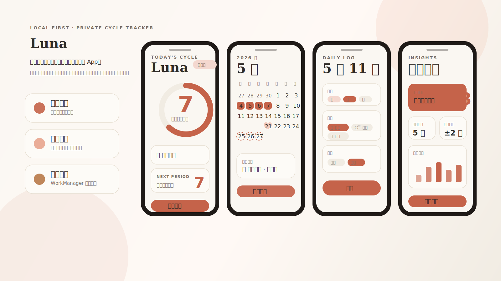

# Luna

> 一款本地优先、温柔克制的月经周期追踪 App。记录经期、心情与症状，查看日历预测和周期洞察，再用本地提醒照顾每一天。



## 为什么用 Luna

Luna 不是又一个把身体数据丢到云端的复杂健康平台。它只做一件事：**帮你更轻松地理解自己的周期**。

- **不用账号，不用联网**：周期、记录、偏好都保存在本机。
- **打开就知道今天处在哪个阶段**：今日页用圆环展示当前进度和下次经期倒计时。
- **日历一眼看懂规律**：已记录经期、预测经期、排卵窗口和每日记录集中在一个月视图里。
- **记录足够快**：流量、心情、症状、备注，几秒钟完成当天状态。
- **洞察不装神弄鬼**：基于历史记录统计平均周期、经期长度、波动和流量分布。
- **提醒留在本地**：经期和排卵提醒通过 WorkManager 调度，不需要后端服务。

> 预测结果仅用于个人记录和生活安排，不构成医疗建议。

## 核心功能

| 功能 | 你能得到什么 |
|---|---|
| **今日** | 当前周期阶段、圆环进度、下次经期倒计时、快速标记经期 |
| **日历** | 月视图查看实际经期、预测经期、排卵窗口与每日记录摘要 |
| **记录** | 按天记录流量、心情、症状和备注 |
| **洞察** | 平均周期、平均经期、周期波动、流量分布图表 |
| **通知** | 经期提前提醒、排卵提醒、通知文案预览 |

## 隐私设计

Luna 的默认边界很简单：

- 没有账号体系。
- **周期与健康相关记录不上传至开发者服务器**；数据保存在本机（Room / DataStore）。
- **不申请网络权限**：应用内《隐私政策》仅加载内置 HTML；商店上架时你仍需在后台填写**单独的 HTTPS 网页链接**（把同一份 HTML 部署到网站上即可），与用户用手机浏览器查看，**不等于 App 联网**。
- 通知权限仅用于 Android 13+ 的本地提醒。

这不是“隐私营销词”，核心数据流在代码层面保持本地。

## 技术栈

- **Kotlin + Jetpack Compose + Material 3**：原生声明式 UI。
- **ViewModel + Navigation Compose**：单 Activity、多页面导航。
- **Room + DataStore Preferences**：本地数据和设置持久化。
- **WorkManager**：本地周期提醒调度。
- **JUnit + Truth**：周期预测、洞察统计、提醒规划等核心逻辑测试。

## 快速开始

### 环境要求

- JDK 17
- Android SDK 34
- Android 8.0（API 26）及以上
- 推荐使用 Android Studio 打开工程

### 打开工程

```bash
git clone <你的仓库地址>
cd gf
```

在 Android Studio 中选择 **File → Open**，打开包含 `settings.gradle.kts` 的项目根目录，等待 Gradle Sync 完成。

### 运行 Debug

```bash
./gradlew :app:installDebug
```

前提：已连接真机或启动模拟器，且 `adb devices` 能看到设备。

### 执行测试

```bash
./gradlew :app:testDebugUnitTest
```

只跑某个测试类：

```bash
./gradlew :app:testDebugUnitTest --tests "com.king.luna.domain.reminder.ReminderPlannerTest"
```

### 打包

Debug APK：

```bash
./gradlew :app:assembleDebug
```

Release APK：

```bash
./gradlew :app:assembleRelease
```

AAB：

```bash
./gradlew :app:bundleRelease
```

产物通常在：

- `app/build/outputs/apk/debug/app-debug.apk`
- `app/build/outputs/apk/release/app-release.apk`
- `app/build/outputs/bundle/release/app-release.aab`

**构建报错只有一行版本号（例如 `25.0.3`）？** 那是当前用来跑 Gradle 的 **JDK 版本过新**（如 JDK 25）；本工程要求 **JDK 17–21** 执行 `./gradlew`。请把 `JAVA_HOME` 指到 JDK 17（或 21），或在 `~/.gradle/gradle.properties` 里设置 `org.gradle.java.home` 指向该 JDK。根目录 `build.gradle.kts` 会在不匹配时给出更完整的中文说明。

## 工程信息

| 项 | 值 |
|---|---|
| 应用名 | `Luna` |
| applicationId | `com.king.luna` |
| namespace | `com.king.luna` |
| versionName | `1.0` |
| minSdk | `26` |
| targetSdk / compileSdk | `34` |

## 路线图

- 数据导出 / 导入
- 暗色主题细化
- 更多统计维度
- 更灵活的提醒策略

## 许可证

本仓库源代码在 **[Apache License 2.0](LICENSE)**（「Apache 许可证，第 2.0 版」）下发布。全文见仓库根目录的 `LICENSE`；版权与归属声明见 `NOTICE`。再分发时请保留原有的许可与NOTICE中的归属说明。
